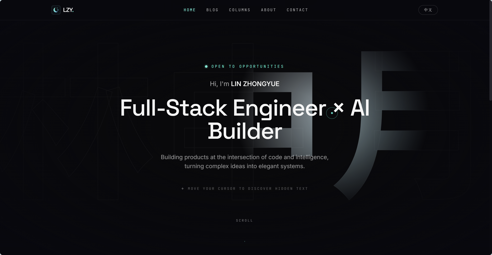
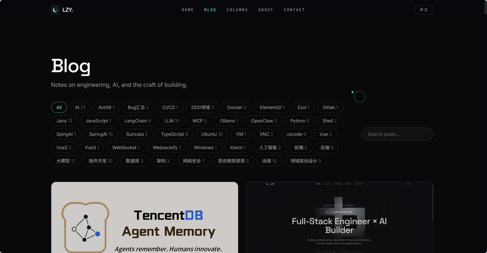
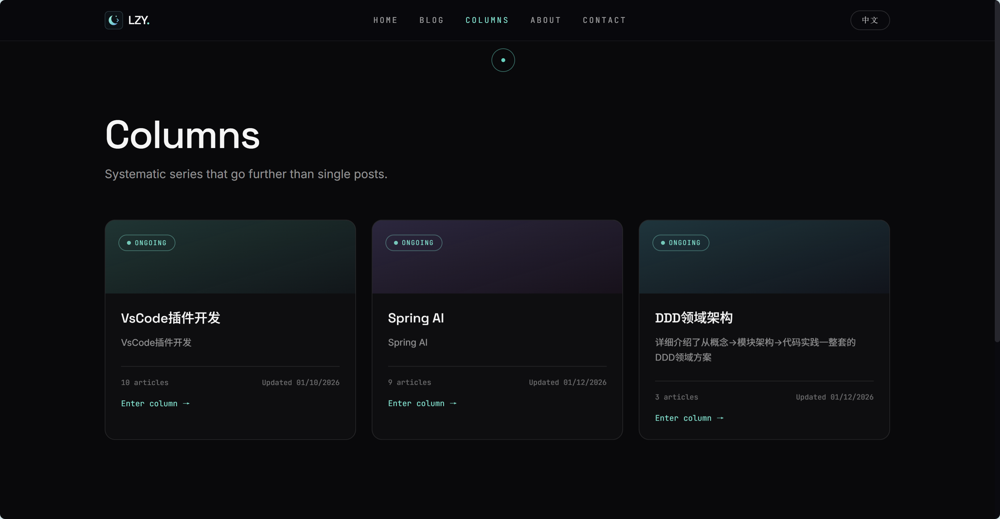
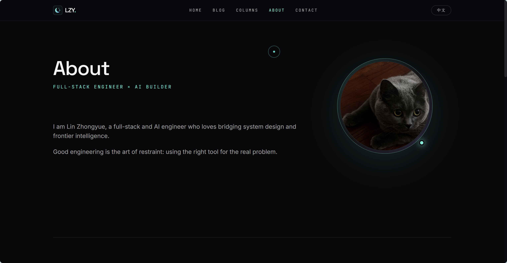
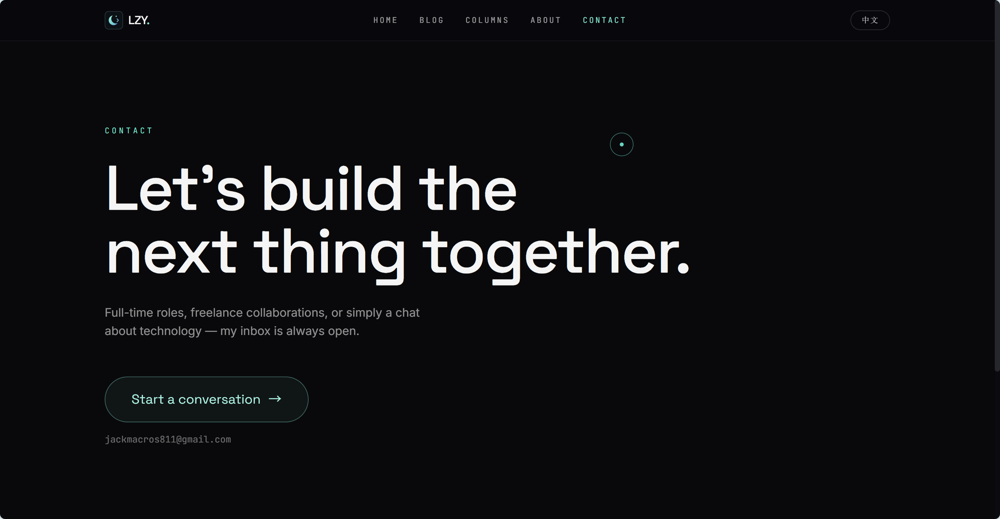
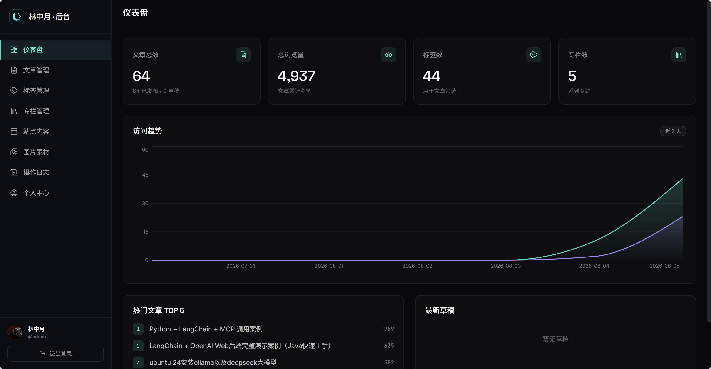

# 林中月个人博客

一个前后端分离的个人博客系统，包含公开博客、管理后台和 Spring Boot API。文章以 Markdown 存储，站点内容、标签、专栏、项目和图片均可在管理后台维护。

线上演示：[linzhongyue.cn](https://linzhongyue.cn)

## 项目组成

| 目录 | 说明 | 本地端口 |
|---|---|---:|
| [`frontend`](./frontend) | 公开博客，React + TypeScript + Vite | 3000 |
| [`app`](./app) | 管理后台，React + TypeScript + Vite | 3001 |
| [`backend`](./backend) | 单体 API，Spring Boot + MySQL + Redis | 8080 |
| [`docs`](./docs) | 需求设计、Nginx 示例和技术文章 | — |
| [`skills`](./skills) | 可选的 Agent Skill，例如博客文章发布器 | — |

两个前端开发服务器都会把 `/api` 代理到 `http://localhost:8080`。生产环境分别构建静态文件，由 Nginx 托管并统一反向代理 `/api/`。

## 主要能力

- Markdown 文章、代码高亮、稳定标题锚点和文章目录
- 标签与专栏管理，专栏支持优先级排序
- 中英文界面，文章正文保持单一版本
- Sa-Token 管理员会话与 Redis 内容缓存
- 七牛云图片上传和素材库
- 站点资料、项目、经历、技能及社交链接管理
- 每日 PV/UV 聚合、文章浏览量和管理操作日志
- MySQL Flyway 迁移与旧博客文章迁移工具

## 界面展示

### 首页



### 博客



### 专栏



### 关于我



### 联系我



### 博客后台



## 本地开发

### 环境要求

- Node.js 20+
- npm 10+
- JDK 21
- Maven 3.9+
- MySQL 8+
- Redis 6+

### 1. 配置后端

创建数据库 `linzhongyue_blog`，然后复制环境变量示例：

```powershell
Copy-Item backend/.env.example backend/.env
```

至少填写数据库密码、Redis 密码和首次启动的管理员密码。`.env` 只用于本机，已被 Git 忽略。

### 2. 启动三个项目

分别在三个终端运行：

```powershell
cd backend
mvn spring-boot:run
```

```powershell
cd frontend
npm ci
npm run dev
```

```powershell
cd app
npm ci
npm run dev
```

访问：

- 公开博客：`http://localhost:3000`
- 管理后台：`http://localhost:3001`
- Swagger UI：`http://localhost:8080/swagger-ui.html`

Flyway 会在首次启动时自动创建数据库结构和示例站点内容。

## 构建与检查

```powershell
cd frontend
npm run build
```

```powershell
cd app
npm run build
```

```powershell
cd backend
mvn test
mvn package
```

各子项目的详细说明和协作约束见对应的 `README.md` 与 `AGENTS.md`。

## 部署概览

1. 构建 `frontend/dist` 和 `app/dist`。
2. 构建 `backend/target/linzhongyue-blog.jar`。
3. 在服务器安全配置环境变量，不上传本地 `.env`。
4. 使用 Nginx 托管两个静态站点，并将 `/api/` 反向代理到后端。

通用 Nginx 示例见 [`docs/nginx-blog.conf.example`](./docs/nginx-blog.conf.example)，Docker Compose 方式见 [`backend/README.md`](./backend/README.md)。

## 安全说明

- 不要提交 `.env`、`backend/config/application.yml`、日志、数据库备份、证书、私钥或云服务凭据。
- `.env.example` 和 `application.example.yml` 只能包含占位值。
- 提交前建议运行密钥扫描工具，并检查 `git status --ignored`。
- 如果秘密曾进入 Git 历史，仅添加 `.gitignore` 不够；必须轮换秘密并清理历史。

## 开源许可

仓库暂未附带开源许可证。公开发布前请根据期望的使用与分发方式选择并添加 `LICENSE`。
